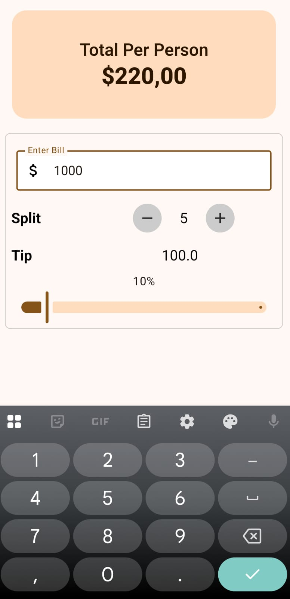

# TipApplication

A modern Android tip calculator application built with Jetpack Compose and Material Design 3. This app helps you easily calculate tips and split bills among multiple people.

## Features

- **Easy Bill Input**: Enter your bill amount with a clean, intuitive interface
- **Tip Calculator**: Adjust tip percentage using a slider (0-100%)
- **Bill Splitting**: Split the total amount among 1-100 people
- **Real-time Calculations**: See tip amount and total per person update instantly
- **Light Theme**: Clean, modern light theme interface optimized for readability
- **Material Design 3**: Beautiful UI following Google's latest design guidelines

## Screenshots

<div align="center">
  
  
</div>

The app features:
- A prominent display showing the total amount per person
- Input field for entering the bill amount
- Plus/minus buttons to adjust the number of people
- Slider to set the tip percentage
- Real-time calculation updates

## Technical Details

### Architecture
- **UI Framework**: Jetpack Compose
- **Design System**: Material Design 3
- **Language**: Kotlin
- **Minimum SDK**: Android API 21+
- **Target SDK**: Latest Android version

### Key Components
- `MainActivity`: Main activity with Compose setup
- `MainPage`: Main UI component with tip calculator interface
- `CalculateUtils`: Utility functions for tip and bill calculations
- `TipApplicationTheme`: Custom theme configuration (light theme only)

### Theme Configuration
The app is configured to use only the light theme for a consistent user experience:
- Dark mode is disabled at both the Compose and Android system levels
- Uses Material 3 light color scheme
- Supports dynamic colors on Android 12+ devices while maintaining light theme

## Installation

### Prerequisites
- Android Studio Arctic Fox or later
- Android SDK 21 or higher
- Kotlin support enabled

### Build Steps
1. Clone the repository
2. Open the project in Android Studio
3. Sync the project with Gradle files
4. Build and run the application

```bash
# Build the project
./gradlew build

# Run on connected device
./gradlew installDebug
```

## Usage

1. **Enter Bill Amount**: Tap the "Enter Bill" field and input your bill total
2. **Set Tip Percentage**: Use the slider to adjust the tip percentage from 0% to 100%
3. **Split the Bill**: Use the +/- buttons to set the number of people splitting the bill
4. **View Results**: The app automatically calculates and displays:
   - Total tip amount
   - Total amount per person

## Development

### Adding New Features
- UI components should be added in the `ui/components/` package
- Business logic should be placed in the `util/` package
- Theme modifications should be made in the `ui/theme/` package

### Code Style
- Follow Kotlin coding conventions
- Use Jetpack Compose best practices
- Maintain Material Design 3 guidelines
- Ensure accessibility compliance

## Contributing

1. Fork the repository
2. Create a feature branch (`git checkout -b feature/amazing-feature`)
3. Commit your changes (`git commit -m 'Add some amazing feature'`)
4. Push to the branch (`git push origin feature/amazing-feature`)
5. Open a Pull Request

## License

This project is open source and available under the [MIT License](LICENSE).

## Author

Created by Furkan Soyleyici

## Support

If you encounter any issues or have suggestions for improvements, please open an issue on the GitHub repository.
